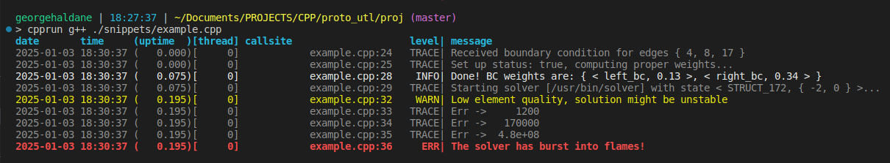
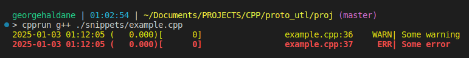

# utl::log

[<- to README.md](..)

[<- to implementation.hpp](../include/UTL/log.hpp)

**log** module aims to provide simple logging facilities for prototyping and small projects.

Goals:

- Intuitive simple to use API
- Unintrusive macros
- Nicely colored formatting that is easy to look at and to `grep`
- Concise syntax (no `<<` or `printf`-like specifiers), just list the arguments and let the variadic handle formatting and conversion
- Reasonably fast performance (in most cases faster than logging things with `std::ofstream`)
- Thread-safe logging with no interweaving messages

Key features:

- Supports multiple sinks
- Supports indentation
- Stringifies arbitrary types based on their type traits

## Definitions

```cpp
// Padding wrappers
template <class T> struct PadLeft  { constexpr PadLeft( const T& val, std::size_t size); }
template <class T> struct PadRight { constexpr PadRight(const T& val, std::size_t size); }
template <class T> struct Pad      { constexpr Pad(     const T& val, std::size_t size); }

// Extendable stringifier (advanced feature)
template <class Derived>
struct StringifierBase {
    template <class T> static void append_bool(     std::string& buffer, const T& value);
    template <class T> static void append_int(      std::string& buffer, const T& value);
    template <class T> static void append_float(    std::string& buffer, const T& value);
    template <class T> static void append_complex(  std::string& buffer, const T& value);
    template <class T> static void append_string(   std::string& buffer, const T& value);
    template <class T> static void append_array(    std::string& buffer, const T& value);
    template <class T> static void append_tuple(    std::string& buffer, const T& value);
    template <class T> static void append_printable(std::string& buffer, const T& value);
    
    template <class T>       static void append(std::string& buffer, const T& value);
    template <class... Args> static void append(std::string& buffer, const Args&... args);
    
    template <class... Args> static std::string stringify(Args&&... args);
    template <class... Args> std::string operator()(Args&&... args);
};

// Stringification & printing
struct Stringifier { /* same API as StringifierBase<> */ };

template <class... Args> void append_stringified(std::string& buffer, Args&&... args);
template <class... Args> std::string stringify(Args&&... args);

template <class... Args> void print(  Args&&... args);
template <class... Args> void println(Args&&... args);

// Logging options
enum class Verbosity { ERR, WARN, INFO, TRACE };
enum class OpenMode { REWRITE, APPEND };
enum class Colors { ENABLE, DISABLE };

struct Columns {
    bool datetime = true;
    bool uptime   = true;
    bool thread   = true;
    bool callsite = true;
    bool level    = true;
    bool message  = true;
};

// Logger sink
struct Sink {
    Sink& set_verbosity(Verbosity verbosity);
    Sink& set_colors(Colors colors);
    Sink& set_flush_interval(clock::duration flush_interval);
    Sink& set_flush_interval(const Columns& columns);
    Sink& skip_header(bool skip = true);
};

Sink& add_ostream_sink(
    std::ostream& os,
    Verbosity verbosity            = Verbosity::INFO,
    Colors colors                  = Colors::ENABLE,
    clock::duration flush_interval = std::chrono::milliseconds{},
    const Columns& columns         = Columns{}
);

Sink& add_file_sink(
    const std::string& filename,
    OpenMode open_mode             = OpenMode::REWRITE,
    Verbosity verbosity            = Verbosity::TRACE,
    Colors colors                  = Colors::DISABLE,
    clock::duration flush_interval = std::chrono::milliseconds{15},
    const Columns& columns         = Columns{}
);

// Logging macros
#define UTL_LOG_ERR(...)
#define UTL_LOG_WARN(...)
#define UTL_LOG_INFO(...)
#define UTL_LOG_TRACE(...)

#define UTL_LOG_DERR(...)
#define UTL_LOG_DWARN(...)
#define UTL_LOG_DINFO(...)
#define UTL_LOG_DTRACE(...)
```

## Methods

### Padding wrappers

```cpp
template <class T> struct PadLeft  { constexpr PadLeft( const T& val, std::size_t size); }
template <class T> struct PadRight { constexpr PadRight(const T& val, std::size_t size); }
template <class T> struct Pad      { constexpr Pad(     const T& val, std::size_t size); }
```

Wrappers used to pad values with specific alignment when using this module's stringification.

| Padding wrapper         | Equivalent `std::ostream` operator                   | Example for { "text", 10 } |
| ----------------------- | ---------------------------------------------------- | -------------------------- |
| `PadLeft{ val, size }`  | `<< std::setw(size) << std::right << val`            | **<**`      text`**>**    |
| `PadRight{ val, size }` | `<< std::setw(size) << std::left << val`             | **<**`text      `**>**     |
| `Pad{ val, size }`      | No center alignment function in the standard library | **<**`    text    `**>**   |

### Extendable stringifier (advanced feature)

`template <class Derived> struct StringifierBase` is compile-time polymorphism base used to build custom stringifier functors.

It is an advanced feature and not need for the regular logging, see [section at the end](#advanced-guide-to-custom-stringifiers) for a proper usage guide.

### Stringification & printing

```cpp
struct Stringifier { /* ... */ };
```

Functor class that contains stringification logic of this module. Can be used to provide third-party APIs with stringification logic of `utl::log`.

Compatible with `utl::mvl` formatters.

```cpp
template <class... Args> void append_stringified(std::string& buffer, Args&&... args);
```

Stringifies all `args...` and appends them to a string `buffer`.

```cpp
template <class... Args> std::string stringify(Args&&... args);
```

Stringifies all `args...` and concatenates them into a string.

```cpp
template <class... Args> void print(  Args&&... args);
template <class... Args> void println(Args&&... args);
```

Stringifies all `args...` and prints the result to `std::cout`.

`println()` also starts a new line at the end.

**Note:** `print`-functions are thread-safe and flush their output instantly.

### Logging options

```cpp
enum class Verbosity { ERR, WARN, INFO, TRACE };
```

Enumeration that determines verbosity level of the logger sink. Sinks will only output messages that are at or above the their priority. Different levels have following priorities:

| Verbosity level | Priority | Logging style  |
| --------------- | -------- | -------------- |
| `ERR`           | **1**    | 🔴 **Bold red** |
| `WARN`          | **2**    | 🟡 Yellow       |
| `INFO`          | **3**    | ⚪ White        |
| `DEBUG`         | **4**    | 🟢 Green        |
| `TRACE`         | **5**    | ⚫ Gray         |

**Note 1:** "Logging style" column applies only of sink colors are set to`Colors::ENABLE`.

**Note 2:** By default `std::ostream` sinks will have verbosity level `INFO`, while file sinks will have verbosity level `TRACE`.

```cpp
enum class OpenMode { REWRITE, APPEND };
```

Enumeration that determines whether file sinks opens the file for rewrite or appends to it.

**Note:** By default file sinks will open in a `REWRITE` mode, use `APPEND` if you want to grow an existing log.

```cpp
enum class Colors { ENABLE, DISABLE };
```

Enumeration that determines whether the sink uses [ANSI color codes](https://en.wikipedia.org/wiki/ANSI_escape_code) to color its output.

This should work in most modern terminals.

**Note:** By default `std::ostream` sinks will be colored, while file sinks will have their colors disabled.

```cpp
struct Columns {
    bool datetime = true;
    bool uptime   = true;
    bool thread   = true;
    bool callsite = true;
    bool level    = true;
    bool message  = true;
};
```

POD struct that determines which columns should be formatted and logged.

### Logger sink

```cpp
struct Sink {
    Sink& set_verbosity(Verbosity verbosity);
    Sink& set_colors(Colors colors);
    Sink& set_flush_interval(clock::duration flush_interval);
    Sink& set_flush_interval(const Columns& columns);
    Sink& skip_header(bool skip = true);
};
```

Class that represents a logger sink (whether it is an `std::ofstream` reference or a managed file).

`set_...()` methods can be used to modify sink options using a reference returned by `add_ostream_sink()` or `add_file_sink()`, rather than passing them all the start.

`skip_header()` method disables the line with column titles at the start, this is mainly useful for appending new data to an existing log.

```cpp
Sink& add_ostream_sink(
    std::ostream& os,
    Verbosity verbosity            = Verbosity::INFO,
    Colors colors                  = Colors::ENABLE,
    clock::duration flush_interval = std::chrono::milliseconds{},
    const Columns& columns         = Columns{}
);
```

Adds sink to ostream `os` with a given set of options. Returns reference to the added sink.

```cpp
Sink& add_file_sink(
    const std::string& filename,
    OpenMode open_mode             = OpenMode::REWRITE,
    Verbosity verbosity            = Verbosity::TRACE,
    Colors colors                  = Colors::DISABLE,
    clock::duration flush_interval = std::chrono::milliseconds{15},
    const Columns& columns         = Columns{}
);
```

Adds sink to the log file `filename` with a given set of options. Returns reference to the added sink.

### Logging macros

```cpp
#define UTL_LOG_ERR(...)
#define UTL_LOG_WARN(...)
#define UTL_LOG_INFO(...)
#define UTL_LOG_TRACE(...)
```

Stringifies arguments `...` and logs them at the corresponding verbosity level.

```cpp
#define UTL_LOG_DERR(...)
#define UTL_LOG_DWARN(...)
#define UTL_LOG_DINFO(...)
#define UTL_LOG_DTRACE(...)
```

Logging macros that only compile in *debug* mode.

## Examples

### Logging to terminal

[ [Run this code](https://godbolt.org/#g:!((g:!((g:!((h:codeEditor,i:(filename:'1',fontScale:14,fontUsePx:'0',j:1,lang:c%2B%2B,selection:(endColumn:1,endLineNumber:16,positionColumn:1,positionLineNumber:16,selectionStartColumn:1,selectionStartLineNumber:16,startColumn:1,startLineNumber:16),source:'%23include+%3Chttps://raw.githubusercontent.com/DmitriBogdanov/UTL/master/single_include/UTL.hpp%3E%0A%0A%23include+%3Cfilesystem%3E%0A%23include+%3Cset%3E%0A%0Aint+main()+%7B%0A++++using+namespace+utl%3B%0A++++using+namespace+std::chrono_literals%3B%0A%0A++++//+Create+some+complex+objects+that+need+logging%0A++++auto+vertex_ids+%3D+std::vector%7B4,+8,+17%7D%3B%0A++++auto+success++++%3D+true%3B%0A++++auto+weights++++%3D+std::map%7B+std::pair%7B+%22left_bc%22,+0.13%7D,+std::pair%7B%22right_bc%22,+0.34%7D+%7D%3B%0A++++auto+solver+++++%3D+std::filesystem::path%7B%22/usr/bin/solver%22%7D%3B%0A++++auto+state++++++%3D+std::tuple%7B+%22STRUCT_172%22,+std::set%7B0,+-2%7D+%7D%3B%0A%0A++++//+Log+stuff+to+console%0A++++UTL_LOG_TRACE(%22Received+boundary+condition+for+edges+%22,+vertex_ids)%3B%0A++++UTL_LOG_TRACE(%22Set+up+status:+%22,+success,+%22,+computing+proper+weights...%22)%3B%0A++++std::this_thread::sleep_for(75ms)%3B%0A%0A++++UTL_LOG_INFO(%22Done!!+BC+weights+are:+%22,+weights)%3B%0A++++UTL_LOG_TRACE(%22Starting+solver+%5B%22,+solver,+%22%5D+with+state+%22,+state,+%22...%22)%3B%0A++++std::this_thread::sleep_for(120ms)%3B%0A%0A++++UTL_LOG_WARN(%22Low+element+quality,+solution+might+be+unstable%22)%3B%0A++++UTL_LOG_TRACE(%22Err+-%3E+%22,+log::PadLeft%7B1.2e%2B3,+8%7D)%3B%0A++++UTL_LOG_TRACE(%22Err+-%3E+%22,+log::PadLeft%7B1.7e%2B5,+8%7D)%3B%0A++++UTL_LOG_TRACE(%22Err+-%3E+%22,+log::PadLeft%7B4.8e%2B8,+8%7D)%3B%0A++++UTL_LOG_ERR(%22The+solver+has+burst+into+flames!!%22)%3B%0A%0A++++//+no+sinks+were+specified+%3D%3E+!'std::cout!'+chosen+by+default%0A%7D%0A'),l:'5',n:'0',o:'C%2B%2B+source+%231',t:'0')),k:65.37859007832898,l:'4',n:'0',o:'',s:0,t:'0'),(g:!((g:!((h:compiler,i:(compiler:clang1600,filters:(b:'0',binary:'1',binaryObject:'1',commentOnly:'0',debugCalls:'1',demangle:'0',directives:'0',execute:'0',intel:'0',libraryCode:'0',trim:'1',verboseDemangling:'0'),flagsViewOpen:'1',fontScale:14,fontUsePx:'0',j:1,lang:c%2B%2B,libs:!(),options:'-std%3Dc%2B%2B17+-O2',overrides:!(),selection:(endColumn:1,endLineNumber:1,positionColumn:1,positionLineNumber:1,selectionStartColumn:1,selectionStartLineNumber:1,startColumn:1,startLineNumber:1),source:1),l:'5',n:'0',o:'+x86-64+clang+16.0.0+(Editor+%231)',t:'0')),header:(),l:'4',m:50,n:'0',o:'',s:0,t:'0'),(g:!((h:output,i:(compilerName:'x86-64+clang+16.0.0',editorid:1,fontScale:14,fontUsePx:'0',j:1,wrap:'1'),l:'5',n:'0',o:'Output+of+x86-64+clang+16.0.0+(Compiler+%231)',t:'0')),k:46.69421860597116,l:'4',m:50,n:'0',o:'',s:0,t:'0')),k:34.621409921671024,l:'3',n:'0',o:'',t:'0')),l:'2',n:'0',o:'',t:'0')),version:4) ]

```cpp
using namespace utl;
using namespace std::chrono_literals;

// Create some complex objects that need logging
auto vertex_ids = std::vector{4, 8, 17};
auto success    = true;
auto weights    = std::map{ std::pair{ "left_bc", 0.13}, std::pair{"right_bc", 0.34} };
auto solver     = std::filesystem::path{"/usr/bin/solver"};
auto state      = std::tuple{ "STRUCT_172", std::set{0, -2} };

// Log stuff to console
UTL_LOG_TRACE("Received boundary condition for edges ", vertex_ids);
UTL_LOG_TRACE("Set up status: ", success, ", computing proper weights...");
std::this_thread::sleep_for(75ms);

UTL_LOG_INFO("Done! BC weights are: ", weights);
UTL_LOG_TRACE("Starting solver [", solver, "] with state ", state, "...");
std::this_thread::sleep_for(120ms);

UTL_LOG_WARN("Low element quality, solution might be unstable");
UTL_LOG_TRACE("Err -> ", log::PadLeft{1.2e+3, 8});
UTL_LOG_TRACE("Err -> ", log::PadLeft{1.7e+5, 8});
UTL_LOG_TRACE("Err -> ", log::PadLeft{4.8e+8, 8});
UTL_LOG_ERR("The solver has burst into flames!");

// no sinks were specified => 'std::cout' chosen by default
```

Output:



### Logging to multiple sinks

[ [Run this code](https://godbolt.org/#g:!((g:!((g:!((h:codeEditor,i:(filename:'1',fontScale:14,fontUsePx:'0',j:1,lang:c%2B%2B,selection:(endColumn:1,endLineNumber:2,positionColumn:1,positionLineNumber:2,selectionStartColumn:1,selectionStartLineNumber:2,startColumn:1,startLineNumber:2),source:'%23include+%3Chttps://raw.githubusercontent.com/DmitriBogdanov/UTL/master/single_include/UTL.hpp%3E%0A%0Aint+main()+%7B%0A++++using+namespace+utl%3B%0A%0A++++//+Log+everything+to+file%0A++++log::add_file_sink(%22verbose.log%22).set_verbosity(log::Verbosity::TRACE)%3B%0A%0A++++//+Log+meaningful+events+to+a+separate+file+with+colors+enabled+for+easier+viewing%0A++++log::add_file_sink(%22info.log%22).set_verbosity(log::Verbosity::INFO).set_colors(log::Colors::ENABLE)%3B%0A%0A++++//+Instead+of+calling+!'set_...()!'+we+can+also+pass+arguments+directly+into+!'add_..._sink()!'+function,%0A++++//+let!'s+also+append+all+logs+to+a+persistent+file+that+doesn!'t+get+rewriten+between+executions%0A++++log::add_file_sink(%22history.log%22,+log::OpenMode::APPEND).skip_header()%3B%0A%0A++++//+Add+another+file+for+logged+messages+only+(no+date/uptime/thread/callsite+columns)%0A++++log::Columns+cols%3B%0A++++cols.datetime+%3D+false%3B%0A++++cols.uptime+++%3D+false%3B%0A++++cols.thread+++%3D+false%3B%0A++++cols.callsite+%3D+false%3B%0A++++log::add_file_sink(%22messages.log%22).set_columns(cols)%3B%0A%0A++++//+Log+warnings+and+errors+to+!'std::cerr!'%0A++++log::add_ostream_sink(std::cerr,+log::Verbosity::WARN,+log::Colors::ENABLE)%3B%0A%0A++++//+Log+some+stuff%0A++++UTL_LOG_DTRACE(%22Some+meaningless+stuff%22)%3B+//+!'D!'+prefix+means+this+will+only+compile+in+dubug%0A++++UTL_LOG_INFO(%22Some+meaningful+stuff%22)%3B%0A++++UTL_LOG_WARN(%22Some+warning%22)%3B%0A++++UTL_LOG_ERR(%22Some+error%22)%3B%0A%7D%0A'),l:'5',n:'0',o:'C%2B%2B+source+%231',t:'0')),k:65.37859007832898,l:'4',n:'0',o:'',s:0,t:'0'),(g:!((g:!((h:compiler,i:(compiler:clang1600,filters:(b:'0',binary:'1',binaryObject:'1',commentOnly:'0',debugCalls:'1',demangle:'0',directives:'0',execute:'0',intel:'0',libraryCode:'0',trim:'1',verboseDemangling:'0'),flagsViewOpen:'1',fontScale:14,fontUsePx:'0',j:1,lang:c%2B%2B,libs:!(),options:'-std%3Dc%2B%2B17+-O2',overrides:!(),selection:(endColumn:1,endLineNumber:1,positionColumn:1,positionLineNumber:1,selectionStartColumn:1,selectionStartLineNumber:1,startColumn:1,startLineNumber:1),source:1),l:'5',n:'0',o:'+x86-64+clang+16.0.0+(Editor+%231)',t:'0')),header:(),l:'4',m:50,n:'0',o:'',s:0,t:'0'),(g:!((h:output,i:(compilerName:'x86-64+clang+16.0.0',editorid:1,fontScale:14,fontUsePx:'0',j:1,wrap:'1'),l:'5',n:'0',o:'Output+of+x86-64+clang+16.0.0+(Compiler+%231)',t:'0')),k:46.69421860597116,l:'4',m:50,n:'0',o:'',s:0,t:'0')),k:34.621409921671024,l:'3',n:'0',o:'',t:'0')),l:'2',n:'0',o:'',t:'0')),version:4) ]

```cpp
using namespace utl;

// Log everything to file
log::add_file_sink("verbose.log").set_verbosity(log::Verbosity::TRACE);

// Log meaningful events to a separate file with colors enabled for easier viewing
log::add_file_sink("info.log").set_verbosity(log::Verbosity::INFO).set_colors(log::Colors::ENABLE);

// Instead of calling 'set_...()' we can also pass arguments directly into 'add_..._sink()' function,
// let's also append all logs to a persistent file that doesn't get rewriten between executions
log::add_file_sink("history.log", log::OpenMode::APPEND).skip_header();

// Add another file for logged messages only (no date/uptime/thread/callsite columns)
log::Columns cols;
cols.datetime = false;
cols.uptime   = false;
cols.thread   = false;
cols.callsite = false;
log::add_file_sink("messages.log").set_columns(cols);

// Log warnings and errors to 'std::cerr'
log::add_ostream_sink(std::cerr, log::Verbosity::WARN, log::Colors::ENABLE);

// Log some stuff
UTL_LOG_DTRACE("Some meaningless stuff"); // 'D' prefix means this will only compile in dubug
UTL_LOG_INFO("Some meaningful stuff");
UTL_LOG_WARN("Some warning");
UTL_LOG_ERR("Some error");
```

Output:



*+ several log files created*

### Printing & stringification

[ [Run this code](https://godbolt.org/#g:!((g:!((g:!((h:codeEditor,i:(filename:'1',fontScale:14,fontUsePx:'0',j:1,lang:c%2B%2B,selection:(endColumn:2,endLineNumber:25,positionColumn:2,positionLineNumber:25,selectionStartColumn:2,selectionStartLineNumber:25,startColumn:2,startLineNumber:25),source:'%23include+%3Chttps://raw.githubusercontent.com/DmitriBogdanov/UTL/master/single_include/UTL.hpp%3E%0A%0A//+A+custom+printable+type%0Astruct+SomeCustomType+%7B%7D%3B%0Astd::ostream%26+operator%3C%3C(std::ostream%26+os,+SomeCustomType)+%7B%0A++++return+os+%3C%3C+%22%3Ccustom+type+string%3E%22%3B%0A%7D%0A%0Aint+main()+%7B%0A++++using+namespace+utl%3B%0A%0A++++//+Printing%0A++++log::println(%22Print+any+objects+you+want,+for+example:+%22,+std::tuple%7B+%22lorem%22,+0.25,+%22ipsum%22+%7D)%3B%0A++++log::println(%22This+is+almost+like+Python!!%22)%3B%0A++++log::println(%22Except+compiled...%22)%3B%0A%0A++++//+Stringification%0A++++assert(+log::stringify(%22int+is+%22,+5)++++++++++%3D%3D+%22int+is+5%22+++++++++++++)%3B%0A++++assert(+log::stringify(std::array%7B+4,+5,+6+%7D)+%3D%3D+%22%7B+4,+5,+6+%7D%22++++++++++)%3B%0A++++assert(+log::stringify(std::pair%7B+-1,+1+%7D)++++%3D%3D+%22%3C+-1,+1+%3E%22++++++++++++)%3B%0A++++assert(+log::stringify(SomeCustomType%7B%7D)++++++%3D%3D+%22%3Ccustom+type+string%3E%22+)%3B%0A++++//+...and+so+on+for+any+reasonable+type+including+nested+containers,%0A++++//+if+you+append+values+to+an+existing+string+!'log::append_stringified(str,+...)!'%0A++++//+can+be+used+instead+of+!'+%2B%3D+log::stringify(...)!'+for+even+better+performance%0A%7D%0A'),l:'5',n:'0',o:'C%2B%2B+source+%231',t:'0')),k:65.37859007832898,l:'4',n:'0',o:'',s:0,t:'0'),(g:!((g:!((h:compiler,i:(compiler:clang1600,filters:(b:'0',binary:'1',binaryObject:'1',commentOnly:'0',debugCalls:'1',demangle:'0',directives:'0',execute:'0',intel:'0',libraryCode:'0',trim:'1',verboseDemangling:'0'),flagsViewOpen:'1',fontScale:14,fontUsePx:'0',j:1,lang:c%2B%2B,libs:!(),options:'-std%3Dc%2B%2B17+-O2',overrides:!(),selection:(endColumn:1,endLineNumber:1,positionColumn:1,positionLineNumber:1,selectionStartColumn:1,selectionStartLineNumber:1,startColumn:1,startLineNumber:1),source:1),l:'5',n:'0',o:'+x86-64+clang+16.0.0+(Editor+%231)',t:'0')),header:(),l:'4',m:50,n:'0',o:'',s:0,t:'0'),(g:!((h:output,i:(compilerName:'x86-64+clang+16.0.0',editorid:1,fontScale:14,fontUsePx:'0',j:1,wrap:'1'),l:'5',n:'0',o:'Output+of+x86-64+clang+16.0.0+(Compiler+%231)',t:'0')),k:46.69421860597116,l:'4',m:50,n:'0',o:'',s:0,t:'0')),k:34.621409921671024,l:'3',n:'0',o:'',t:'0')),l:'2',n:'0',o:'',t:'0')),version:4) ]

```cpp
// A custom printable type
struct SomeCustomType {};
std::ostream& operator<<(std::ostream& os, SomeCustomType) {
    return os << "<custom type string>";
}

// ...

using namespace utl;

// Printing
log::println("Print any objects you want, for example: ", std::tuple{ "lorem", 0.25, "ipsum" });
log::println("This is almost like Python!");
log::println("Except compiled...");

// Stringification
assert( log::stringify("int is ", 5)          == "int is 5"             );
assert( log::stringify(std::array{ 4, 5, 6 }) == "{ 4, 5, 6 }"          );
assert( log::stringify(std::pair{ -1, 1 })    == "< -1, 1 >"            );
assert( log::stringify(SomeCustomType{})      == "<custom type string>" );
// ...and so on for any reasonable type including nested containers,
// if you append values to an existing string 'log::append_stringified(str, ...)'
// can be used instead of ' += log::stringify(...)' for even better performance
```

Output:
```
Print any objects you want, for example: < lorem, 0.25, ipsum >
This is almost like Python!
Except compiled...
```

## Advanced guide to custom stringifiers

In some cases, it can be quite beneficial to declare a custom stringifier that uses a generic logic of this module's stringification, but adds a few alterations. The usual use cases for this include:

- Adding decorators for text-based export formats (JSON, LaTeX, Mathematica, etc.)
- Adding type-specific optimizations
- Customizing formatting to taste

The structure of `StringifierBase<>` can be described by a following call graph:

```cpp
template <class... Args> std::string operator()(Args&&... args);
    // Calls ->
	template <class... Args> static std::string stringify(Args&&... args);
    	// Calls ->
        template <class... Args> static void append(std::string& buffer, const Args&... args);
            // Calls multiple times ->
            template <class T> static void append(std::string& buffer, const T& value);
                // Calls one of ->
                template <class T> static void append_bool(     std::string& buffer, const T& value);
                template <class T> static void append_int(      std::string& buffer, const T& value);
                template <class T> static void append_enum(     std::string& buffer, const T& value);
                template <class T> static void append_float(    std::string& buffer, const T& value);
                template <class T> static void append_complex(  std::string& buffer, const T& value);
                template <class T> static void append_string(   std::string& buffer, const T& value);
                template <class T> static void append_array(    std::string& buffer, const T& value);
                template <class T> static void append_tuple(    std::string& buffer, const T& value);
                template <class T> static void append_adaptor(  std::string& buffer, const T& value);
                template <class T> static void append_printable(std::string& buffer, const T& value);
```

By inheriting it with [CRTP]() we can inject additional logic into that chain to customize behavior. 

### Examples

#### Add additional formatting to values 

Let's say we want a version of stringifier that adds `$` around the floats so we can export them to [LaTeX]() as formulas. To do so we can declare a derived class that overrides `append_bool()` with additional behavior:

```cpp
struct LaTeXStringifier : public log::StringifierBase<LaTeXStringifier> {
    using base = log::StringifierBase<LaTeXStringifier>;
    
    template <class T>
    static void append_float(std::string &buffer, const T& value) {
        buffer += '$';
        base::append_float(buffer, value);
        buffer += '$';
    }
};
```

This new stringifier will now wrap all floats in dollar signs:

```cpp
assert( log::Stringifier{}(0.5)      == "0.5"  );
assert( log::LaTeXStringifier{}(0.5) == "$0.5$" );

// Works in compound types too
assert( log::Stringifier{}(std::array{ 0.5, 2.5 })      == "{ 0.5, 2.5 }"     );
assert( log::LaTeXStringifier{}(std::array{ 0.5, 2.5 }) == "{ $0.5$, $2.5$ }" );
```

#### Override formatting of specific types

Let's say we want out stringifier to handle `std::vector<int>` in a completely specific way and print it as `integers: [ 1 2 3 ... ]` instead of the usual `{ 1, 2, 3, ... }`. To do so we can add overloads of `append()` for that type, overloads will take priority over the template:

```cpp
struct SpecialStringifier : public log::StringifierBase<SpecialStringifier> {
    using base = log::StringifierBase<SpecialStringifier>;
    
    // Bring base class 'append()' here so we don't shadow it
    using base::append;
    
    // Declare overloads for types with specific formatting
    static void append(std::string &buffer, const std::vector<int> &value) {
        buffer += "integers: [ ";
        for (auto e : value) buffer += std::to_string(e) + " ";
        buffer += " ]";
    }
};
```

This new stringifier will now format `std::vector<int>` in a unique way:

```cpp
assert( log::Stringifier{}(std::vector{ 1, 2, 3 })        == "{ 1, 2, 3 }"         );
assert( log::SpecialStringifier{}(std::vector{ 1, 2, 3 }) == "integers: [ 1 2 3 ]" );
```

**Trivia:** The underlying mechanism that allows us to do this is based the on standard overload resolution priority, which is *regular functions* > *template functions* > *variadic template functions*.

**Note:** The same technique can be used to add optimizations for specific types, for example, `log::FastStringifier` adds overloads for faster formatting of singular integers that don't require any of the "appending" logic.

#### Make custom type compatible with stringifier

Most custom containers should be compatible with `log::Stringifier` (and by consequence, `log::stringify()`, `log::println()` and etc.) out of the box, the stringifier will automatically expand over the type `T` recursively as long as it fits into one of the following groups:

| Group                | Priority | Criteria                                                     |
| -------------------- | -------- | ------------------------------------------------------------ |
| `append_bool()`      | **1**    | `T` is `bool`                                                |
| `append_string()`    | **2**    | `T` is `char` or convertible to `std::string` / `std::string_view` |
| `append_int()`       | **3**    | `T` is integral                                              |
| `append_enum()`      | **4**    | `T` is enumeration                                           |
| `append_float()`     | **5**    | `T` is floating point                                        |
| `append_complex()`   | **6**    | `T` has `real()`, `imag()` methods                           |
| `append_array()`     | **7**    | `T` has `begin()`, `end()` methods that return an incrementable iterator |
| `append_tuple()`     | **8**    | `T` supports `std::get<>()` and `std::tuple_size()`          |
| `append_adaptor()`   | **9**    | `T` has member type `container_type`                         |
| `append_printable()` | **10**   | `T` supports `std::ostream` output with `operator <<`        |

If none of this is the case, the easiest way would be to just declare an `std::ostream` output operator like this:

```cpp
std::ostream& operator<<(std::ostream os, const CustomType& value) {
    return os << "<some string corresponding to the value>";
}
```

A more "proper" and performant way however, would be to create a custom stringifier that has an overload for `CustomType` like it was done in previous example.
