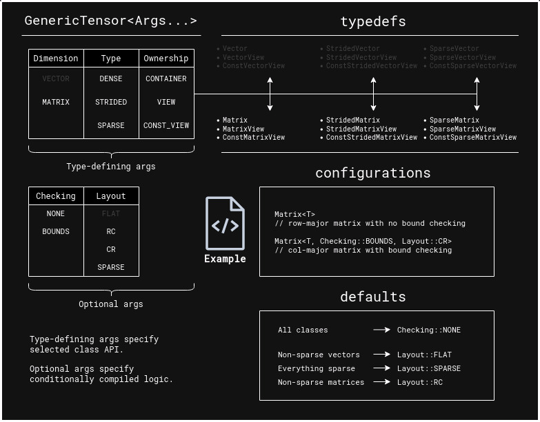

# utl::mvl

[<- back to README.md](https://github.com/DmitriBogdanov/prototyping_utils/tree/master)

**mvl** (aka **M**atrix **V**iew **L**ibrary) implements generic classes for dense/strided/sparse vectors, matrices and views.

Unlike most existing matrix implementations, **mvl** focuses on data-oriented matrices that support arbitrary element types and can be used similarly to [std::vector](https://en.cppreference.com/w/cpp/container/vector). It's main goal is simplicity of API and interoperability with most existing implementations.

> [!Important]
> Due to rather extensive API, seeing [usage examples](##example-1-(basic-usage)) first might be helpful.

> [!Tip]
> Use GitHub built-in [table of contents](https://github.blog/changelog/2021-04-13-table-of-contents-support-in-markdown-files/) to navigate this page.

## Class structure

All vectors, matrices and views in **mvl** stem from a single generic template class, that can be specialized into any available behaviour through its template parameters:
```cpp
// Generic template
template <
    typename    T,
    Dimension   dimension,
    Type        type,
    Ownership   ownership,
    Checking    checking,
    Layout      layout
>
class GenericTensor;

// Example of manual specialization
using IntegerMatrix = GenericTensor<int, Dimension::MATRIX, Type::DENSE, Ownership::CONTAINER, Checking::NONE, Layout::RC>;
```

> [!Note]
> Here **tensor** will be used to refer to arbitrary vectors, matrices and views, not necessarily in a [mathematical sense](https://en.wikipedia.org/wiki/Tensor).

This approach provides a generic way of working with matrices that is mostly agnostic to underlying layout and implementation. In practical usage manual specialization is rarely needed due to provided typedefs, however it is a powerful tool for implementing generic APIs.

**Below in an overview of all available arguments, typedefs and defaults:**



## Performance & linear algebra operations

**mvl** classes are intented to be lightweight wrappers that allow convenient data manipulation without any performance tradeoffs on basic operations (loops, indexing, standard algorithms, etc.), this is achieved through conditional compilation and compile-time resolution of all indexing formulas. See [benchmarks]() for details.

Due to its arbitrary-data approach, linear algebra operations are intentionally **NOT** implemented by **mvl**. Numeric computation is a separate field and is much better handled by existing libraries like [XTensor](https://xtensor.readthedocs.io), [Eigen](https://eigen.tuxfamily.org) and [Blaze](https://bitbucket.org/blaze-lib/blaze). In cases where matrix computation is needed, it's heavily recommended to use matrices provided by those libraries as a main implementation, and whenever **mvl** functions are needed, those can be wrapped in **mvl** view. For example:

```cpp
Eigen::MatrixXd A; // in Eigen col-major by default

// Do some computation with 'A'

mvl::MatrixView<double, Checking::NONE, Layout::CR> view(A.rows(), A.cols(), A.data());

// Use 'view' like any other MVL matrix
```

## Definitions

```cpp
// Generic template
// 'requires' tag specifies methods that get conditionally compiled by some specializations
// 'Callable<Args...>' refers to a template parameter, restricted to callable objects with a specific signature
template <
    typename    T,
    Dimension   dimension,
    Type        type,
    Ownership   ownership,
    Checking    checking,
    Layout      layout
>
class GenericTensor {
    // - Generic constructors -
    GenericTensor(const self&  other);
    GenericTensor(      self&& other);
    
    self& operator=(self&  other);
    self& operator=(self&& other);
        
    // - Parameter reflection -
    struct params {
        constexpr static Dimension   dimension
        constexpr static Type        type;
        constexpr static Ownership   ownership;
        constexpr static Checking    checking;
        constexpr static Layout      layout;
    };
    
    // - Member types -
    using self            = GenericTensor;
    using value_type      = T;
    using size_type       = std::size_t;
    using difference_type = std::ptrdiff_t;
    using reference       = T&;
    using const_reference = const T&;
    using pointer         = T*;
    using const_pointer   = const T*;
    
    // - Iterators -
    using               iterator;
    using       reverse_iterator;
    using         const_iterator;
    using const_reverse_iterator;
    
    iterator begin();
    iterator   end();
    
    reverse_iterator rbegin();
    reverse_iterator   rend();
    
    const_iterator  begin() const;
    const_iterator    end() const;
    const_iterator cbegin() const;
    const_iterator   cend() const;
    
    const_reverse_iterator  rbegin() const;
    const_reverse_iterator    rend() const;
    const_reverse_iterator crbegin() const;
    const_reverse_iterator   crend() const;   
    
    // - Basic getters -
    size_type       size() const;
    size_type       rows() const; // requires MATRIX
    size_type       cols() const; // requires MATRIX
    size_type row_stride() const; // requires MATRIX && STRIDED
    size_type col_stride() const; // requires MATRIX && STRIDED
    
    const_pointer  data() const; // requires DENSE || STRIDED
    pointer        data();       // requires DENSE || STRIDED
    bool          empty() const;
    
    // - Advanced getters -
    bool      contains(const_reference value) const; // requires value_type::operator==()
    size_type    count(const_reference value) const; // requires value_type::operator==()
    
    bool is_sorted()                                                     const; // requires value_type::operator<()
    bool is_sorted(Callable<bool(const_reference, const_reference)> cmp) const; // requires value_type::operator<()
    
    std::vector<value_type> to_std_vector() const;
    
    // - Indexation -
    const_reference front() const;
    const_reference  back() const;
    reference       front();
    reference        back();
    
    reference       operator[](size_type idx);
    reference       operator()(size_type i, size_type j);       // requires MATRIX
    const_reference operator[](size_type idx)            const;
    const_reference operator()(size_type i, size_type j) const; // requires MATRIX
    
    // - Index conversions -
    size_type get_idx_of_ij(size_type i, size_type j) const; // requires MATRIX
    Index2D   get_ij_of_idx(size_type idx)            const; // requires MATRIX
    
    size_type extent_major() const; // requires MATRIX
    size_type extent_minor() const; // requires MATRIX
    
    // - Reductions -
    value_type     sum() const; // requires value_type::operator+()
    value_type product() const; // requires value_type::operator*()
    value_type     min() const; // requires value_type::operator<()
    value_type     max() const; // requires value_type::operator<()
    
    // - Predicate operations -
    bool true_for_any(Callable<bool(const_reference)>                       predicate) const;
    bool true_for_any(Callable<bool(const_reference, size_type)>            predicate) const;
    bool true_for_any(Callable<bool(const_reference, size_type, size_type)> predicate) const; // requires MATRIX
    bool true_for_all(Callable<bool(const_reference)>                       predicate) const;
    bool true_for_all(Callable<bool(const_reference, size_type)>            predicate) const;
    bool true_for_all(Callable<bool(const_reference, size_type, size_type)> predicate) const; // requires MATRIX
    
    // - Const algorithms -
    const self& for_each(Callable<void(const_reference)>                       func) const;
    const self& for_each(Callable<void(const_reference, size_type)>            func) const;
    const self& for_each(Callable<void(const_reference, size_type, size_type)> func) const; // requires MATRIX
    
    // - Mutating algorithms -
    const self& for_each(Callable<void(reference)>                       func) const;
    const self& for_each(Callable<void(reference, size_type)>            func) const;
    const self& for_each(Callable<void(reference, size_type, size_type)> func) const; // requires MATRIX
    self& fill(const_reference value);
    
    self&        sort(); // requires value_type::operator<()
    self& stable_sort(); // requires value_type::operator<()
    self&        sort(Callable<bool(const_reference, const_reference)> cmp);
    self& stable_sort(Callable<bool(const_reference, const_reference)> cmp);
};
```

> [!Note]
> `noexcept` specifiers are omitted in this section to reduce verbosity.

## Methods

### Parameter reflection

### Member types

### Indexation

### Index conversions

### Reductions

### Predicate operations

### Algorithms


> ```cpp
> timer::start();
> ```

Sets internal start timepoint for elapsed measurements.

> ```cpp
> double timer::elapsed_ms();
> double timer::elapsed_sec();
> double timer::elapsed_min();
> double timer::elapsed_hours();
> ```

Returns elapsed time as `double`. Internally time is measured in nanoseconds.

> ```cpp
> std::string timer::elapsed_string_ms();
> std::string timer::elapsed_string_sec();
> std::string timer::elapsed_string_min();
> std::string timer::elapsed_string_hours();
> ```

Returns elapsed time as `std::string` with units.

> ```cpp
> std::string timer::elapsed_string_fullform();
> ```

Returns elapsed time in format `%H hours %M min %S sec %MS ms`.

> ```cpp
> std::string timer::datetime_string();
> std::string timer::datetime_string_id();
> ```

Returns current local date and time in format `%y-%m-%d %H:%M:%S` or `%y-%m-%d-%H-%M-%S`. Since first format is contains characters illegal in filenames, second format can be used instead.

## Example 1 (basic usage)

[ [Run this code](https://godbolt.org/#g:!((g:!((g:!((h:codeEditor,i:(filename:'1',fontScale:14,fontUsePx:'0',j:1,lang:c%2B%2B,selection:(endColumn:1,endLineNumber:7,positionColumn:1,positionLineNumber:7,selectionStartColumn:1,selectionStartLineNumber:7,startColumn:1,startLineNumber:7),source:'%23include+%3Chttps://raw.githubusercontent.com/DmitriBogdanov/prototyping_utils/master/source/proto_utils.hpp%3E%0A%0Aint+main()+%7B%0A++++using+namespace+utl%3B%0A%0A++++timer::start()%3B%0A%0A++++std::this_thread::sleep_for(std::chrono::milliseconds(3700))%3B%0A%0A++++std::cout%0A++++++++%3C%3C+%22Time+elapsed+during+sleep_for(3700+ms):%5Cn%22%0A++++++++%3C%3C+timer::elapsed_string_sec()+%3C%3C+%22%5Cn%22%0A++++++++%3C%3C+timer::elapsed_string_fullform()+%3C%3C+%22%5Cn%22%3B%0A%0A++++return+0%3B%0A%7D%0A'),l:'5',n:'0',o:'C%2B%2B+source+%231',t:'0')),k:71.71783148269105,l:'4',n:'0',o:'',s:0,t:'0'),(g:!((g:!((h:compiler,i:(compiler:clang1600,filters:(b:'0',binary:'1',binaryObject:'1',commentOnly:'0',debugCalls:'1',demangle:'0',directives:'0',execute:'0',intel:'0',libraryCode:'0',trim:'1'),flagsViewOpen:'1',fontScale:14,fontUsePx:'0',j:1,lang:c%2B%2B,libs:!(),options:'-std%3Dc%2B%2B17+-O2',overrides:!(),selection:(endColumn:1,endLineNumber:1,positionColumn:1,positionLineNumber:1,selectionStartColumn:1,selectionStartLineNumber:1,startColumn:1,startLineNumber:1),source:1),l:'5',n:'0',o:'+x86-64+clang+16.0.0+(Editor+%231)',t:'0')),header:(),l:'4',m:50,n:'0',o:'',s:0,t:'0'),(g:!((h:output,i:(compilerName:'x86-64+clang+16.0.0',editorid:1,fontScale:14,fontUsePx:'0',j:1,wrap:'1'),l:'5',n:'0',o:'Output+of+x86-64+clang+16.0.0+(Compiler+%231)',t:'0')),k:46.69421860597116,l:'4',m:50,n:'0',o:'',s:0,t:'0')),k:28.282168517308946,l:'3',n:'0',o:'',t:'0')),l:'2',n:'0',o:'',t:'0')),version:4) ]
```cpp
using namespace utl;

timer::start();

std::this_thread::sleep_for(std::chrono::milliseconds(3700));

std::cout
    << "Time elapsed during sleep_for(3700 ms):\n"
    << timer::elapsed_string_sec() << "\n"
    << timer::elapsed_string_fullform() << "\n";
```

Output:
```
Time elapsed during sleep_for(3700 ms):
3.711095 sec
0 hours 0 min 3 sec 712 ms
```

## Benchmarks