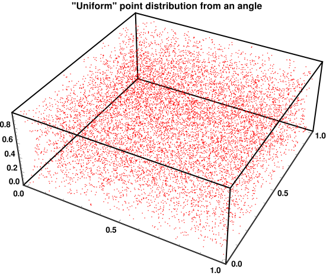
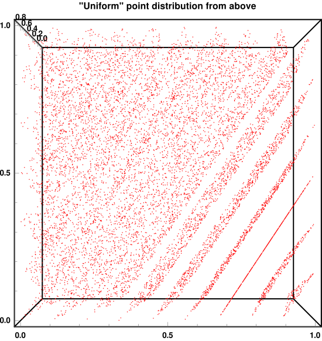

# utl::random

[<- back to README.md](..)

**random** module adds most of the sensible random functions one would need.

It implements several random bit generators seamlessly compatible with [&lt;random&gt;](https://en.cppreference.com/w/cpp/header/random):

- [32-bit Romu Trio PRNG](https://www.romu-random.org/)

- [32-bit Bob Jenkins Small Fast PRNG](https://burtleburtle.net/bob/rand/smallprng.html)

- [64-bit Romu Duo Jr. PRNG](https://www.romu-random.org/)

- [64-bit Bob Jenkins Small Fast PRNG](https://burtleburtle.net/bob/rand/smallprng.html)

- [64-bit Xoshiro256++ PRNG](https://prng.di.unimi.it/)

- [64-bit XorShift64&ast; PRNG](https://www.jstatsoft.org/article/view/v008i14)

- [ChaCha20 CSPRNG](https://en.wikipedia.org/wiki/Salsa20#ChaCha_variant)

These pseudorandom number generators (aka [PRNGs](https://en.wikipedia.org/wiki/Pseudorandom_number_generator)) cover most of the common uses cases better than somewhat outdated standard library implementations, see [notes on random number generation](#notes-on-random-number-generation).

**Why use `utl::random` over built-in functions?**

- Easier API for most "daily" use cases
- Likely to be [faster](#overview-of-available-prngs) than built-in methods
- Provides [better quality random](#notes-on-random-number-generation) than built-in methods
- Reproducible results, built-in engines may differ compiler to compiler
- Random generators work even in `constexpr` context
- An option to use [cryptographically secure PRNG](https://en.wikipedia.org/wiki/Cryptographically_secure_pseudorandom_number_generator)
- More reliable sources of entropy than [std::random_device](https://en.cppreference.com/w/cpp/numeric/random/random_device)

## Definitions

```cpp
// PRNG implementations
namespace generators {
    class GeneratorAPIExample {
        using result_type;
        
        static constexpr result_type min() noexcept;
        static constexpr result_type max() noexcept;
        
        constexpr GeneratorAPI(result_type seed);
        constexpr void    seed(result_type seed) noexcept;
        
        template<class SeedSeq> GeneratorAPI(SeedSeq& seq);
        template<class SeedSeq> void    seed(SeedSeq& seq);
        
        constexpr result_type operator()() noexcept;
    };
    
    // 32-bit PRNGs
    class RomuTrio32         { /* Generator API */ };
    class JSF32              { /* Generator API */ };
    // 64-bit PRNGs
    class RomuDuoJr          { /* Generator API */ };
    class JSF64              { /* Generator API */ };
    class Xoshiro256PlusPlus { /* Generator API */ };
    class Xorshift64Star     { /* Generator API */ };
    // CSPRNGs
    class ChaCha20           { /* Generator API */ };
}

// Default global PRNG
using default_generator_type = generators::Xoshiro256PlusPlus;
using default_result_type    = std::uint64_t;

inline default_generator_type default_generator;

void seed(std::uint64_t seed);
void seed_with_entropy();

// Entropy
std::seed_seq entropy_seq();
std::uint32_t entropy();

// Convenient random functions
int rand_int(int min, int max);
int rand_uint(unsigned int min, unsigned int max);

float rand_float();                     // U[0, 1]     uniform distribution
float rand_float(float min, float max); // U[min, max] uniform distribution
float rand_normal_float();              // N(0, 1)      normal distribution

double rand_double();                       // U[0, 1]     uniform distribution
double rand_double(double min, double max); // U[min, max] uniform distribution
double rand_normal_float();                 // N(0, 1)      normal distribution

bool rand_bool();

template<class T>
const T& rand_choise(std::initializer_list<T> objects);

template<class T>
T rand_linear_combination(const T& A, const T& B);
```

## Methods

### Random bit generators

> ```cpp
> class GeneratorAPIExample {
>    using result_type;
> 
>    static constexpr result_type min() noexcept;
>    static constexpr result_type max() noexcept;
> 
>    constexpr GeneratorAPI(result_type seed);
>    constexpr void    seed(result_type seed) noexcept;
> 
>    template<class SeedSeq> GeneratorAPI(SeedSeq& seq);
>    template<class SeedSeq> void    seed(SeedSeq& seq);
> 
>    constexpr result_type operator()() noexcept;
> };
> 
> // 32-bit PRNGs
> class RomuTrio32         { /* Generator API */ };
> class JSF32              { /* Generator API */ };
> // 64-bit PRNGs
> class RomuDuoJr          { /* Generator API */ };
> class JSF64              { /* Generator API */ };
> class Xoshiro256PlusPlus { /* Generator API */ };
> class Xorshift64Star     { /* Generator API */ };
> // CSPRNGs
> class ChaCha20           { /* Generator API */ };
> ```

All of these generators satisfy [uniform random bit generator generator requirements](https://en.cppreference.com/w/cpp/named_req/UniformRandomBitGenerator) and [std::uniform_random_bit_generator](https://en.cppreference.com/w/cpp/numeric/random/uniform_random_bit_generator) concept, which makes them drop-in replacements for standard generators such as `std::mt19937`.

Unlike standard generators these can also be used in `constexpr` functions.

**Note:** Unfortunately, distributions such as `std::uniform_int_distribution` aren't marked `constexpr`, which makes non-trivial number generation a bit annoying. Their output will have to be used directly, similar to `rand()`.

### Default global PRNG

> ```cpp
> using default_generator_type = generators::Xoshiro256PlusPlus;
> using default_result_type    = std::uint64_t;
> ```

Typedefs for default PRNG of this module and its return type.

> ```cpp
> inline default_generator_type default_generator;
> ```

A global instance of **Xoshiro256++** generator used by convenience functions of this module.

**Note:** All random engines are inherently non-thread-safe, a proper way of generating numbers in parallel is to create local generators on each thread and seed them with different values.

> ```cpp
> random::seed(uint64_t random_seed);
> ```

Seeds global random engine with `random_seed`.

> ```cpp
> random::seed_with_entropy();
> ```

Seeds global random engine using combined entropy from several sources, the main one being [std::random_device](https://en.cppreference.com/w/cpp/numeric/random/random_device) which uses hardware source of non-deterministic randomness.

It is effectively the same as seeding global engine with `random::entropy_seq()`.

**Note 1:** Resist the temptation to seed engines with `std::time(NULL)`, using proper entropy is how it should be done.

**Note 2:** If no hardware randomness is available, `std::random_device` falls back onto an internal PRNG, it is generally not an issue due to multiple sources of entropy, however it makes cryptographic usage quite tricky.

### Entropy

```cpp
std::seed_seq entropy_seq();
std::uint32_t entropy();
```

These functions serve a role of a "slightly better and more convenient [std::random_device](https://en.cppreference.com/w/cpp/numeric/random/random_device)".

`std::random_device` has a critical deficiency in it's design — in case its implementation doesn't provide a proper source of entropy, it is free to fallback onto a regular PRNGs that don't change from run to run. The method [std::random_device::entropy()](https://en.cppreference.com/w/cpp/numeric/random/random_device/entropy) which should be able to detect that information is notoriously unreliable and returns different things on every platform.

`entropy()` samples several sources of entropy (including the `std::random_device` itself) and is guaranteed to change from run to run even if it can't provide a proper hardware-sourced entropy that would be suitable for cryptography. It can be used as a drop-in replacement to `std::random_device{}()` calls.

`entropy_seq()` generates a full [std::seed_seq](https://en.cppreference.com/w/cpp/numeric/random/seed_seq) instead of a single number, it is mainly useful for seeding generators with a large state.

**Note:** These functions are thread-safe.

### Convenient random functions

> ```cpp
> int random::rand_int(int min, int max);
> int random::rand_uint(unsigned int min, unsigned int max);
> ```

Returns random integer in a given range.

> ```cpp
> float random::rand_float();
> double random::rand_double();
> ```

Returns random float/double in a $[0, 1]$ range.

> ```cpp
> float random::rand_float(float min, float max);
> double random::rand_double(double min, double max);
> ```

Returns random float/double in a $[min, max]$ range.

> ```cpp
> float random::rand_normal_float();
> double random::rand_normal_double();
> ```

Returns random normally distributed float/double with a mean $0$ and variance $1$.

> ```cpp
> bool random::rand_bool();
> ```

Returns `true`/`false` randomly. Effectively same as `rand_uint(0, 1)`.

> ```cpp
> const T& rand_choise(std::initializer_list<T> objects);
> ```

Returns randomly chosen object from a list.

> ```cpp
> T rand_linear_combination(const T& A, const T& B);
> ```

Returns $\alpha A + (1 - \alpha) B$, with random $0 < \alpha < 1$. Useful for vector and color operations. Object must have  a defined `operator+()` and scalar `operator*()`.

## Examples

### Getting random values

[ [Run this code](https://godbolt.org/#z:OYLghAFBqd5QCxAYwPYBMCmBRdBLAF1QCcAaPECAMzwBtMA7AQwFtMQByARg9KtQYEAysib0QXACx8BBAKoBnTAAUAHpwAMvAFYTStJg1DIApACYAQuYukl9ZATwDKjdAGFUtAK4sGIAJzSrgAyeAyYAHI%2BAEaYxHoADqgKhE4MHt6%2BAdJJKY4CoeFRLLHxXLaY9vkMQgRMxAQZPn6BFVVptfUEhZExcXoKdQ1NWa2DXT3FpRIAlLaoXsTI7BzmAMxhyN5YANQma24IBAQJCiAA9OfETADuAHTAhAhe0V5KS7KMBHdoLOcAIixCMQ8BZUMB0IZUAA3c5yAAqwXOLCYgzi5xSRnoAH1NttMHDEXcEAkEvtsCYNABBSlUsIEHYosIQGZ7ADsVmpO25OzeYWAO2YbAUCSYy15BFo%2B05NK5POuDHQqBYIBASkw6GxNye2K%2BxFQCQAnizpbSeTtBuhVWgvAQzeaefs3E69mYzArNfSIBpSDsuBoNKyHcHzft/q6zHsDi6PcrVR7cYJvb7/YGQ%2Bmo86DhGTABWNwMcxme3Bp0uosJpUvegsjN1sMRzMxwxKlUgSsLaI1oN1kNl7NFvMFwdy0vRgdujvVzAQAC0ud9uZ7vYbRab2djbanXZn88Xy/r47cOfzhbdJYd/ePFZb2OiqE8td7GdXbvXx838dv98fB%2BfoaPE9h3PUdL0Am9FWxZAEFQPAlAgEwOXKHYzF9NZEP%2BP8APDNcrx2T921vaDYPgxCLGQ1CdnQtlMMPLNr3PU8RypdM8IgzVaDCTB6ig5VojCJhqggMw7jQu5WVfSM8IIhNOPCHjfn45ghJEsSJPAxjgOLNYZQw2kODmWhOFzXg/A4LRSFQThnUsawLQWJZMFdNYeFIAhNAMuYAGsQDZLg7j8tkAA4XMkIKzAANn8f0FyMjhJFMjzLM4Xgzh9dzzIM0g4FgGBEBQZUEjoOJyEoX4ivoeItkMYAuAigM%2BDoAg4jOCBoiSpT6kNThXM64hDQAeWibRMAcHreF%2BNhBAGhhaG6zLSCwV5gDcMRaDObheCwFEsRWCz8GIUbHGhTANoszBVFG209t4elKiSzjomufqPCwJKCBBFVNtIE7iHvJR/kwHbgDk0BMrmKgDGABQADU8EwG4BoSRhxpkQQRDEdgpDR%2BQlDUJLdHKAwjBQaxrH0PBojOSA5gNaoNtnS0w1MWzLC4NkdlnAazF4GE4hBLBqZZNojrSFxFRGPxyhCLipn6cpclSARJcSZIlYYSY%2BjKEWHA6IZGk8ZoBkqUWBE6BpNZKeXbH1lXynGC3Za12Z5kWZYXbikzSDMiyrI4HZVCCiLZwiyQdmqow/Qiu4NBjnYIFwQgSGcrgZl4DKtBmOYEG4rB4mFuKEtIFVcx9H3eZS2wQHSjy5hy/KFhOW1SogcriuICJWBWQPg9D8PiYFOqY5j3gNSTgW9H4dHRHEbGp9xlR1AWwnSBua4EnGwzjMSha/YG20EltHZUCoAOg5DsOI8H6PY40eOPBYCq4hTtO3Nr7yQEkaOoskMwuCDjQuZ/B%2BTqvoTgRcS5lySn7VK1c37gw/mYIKdwkF/wikFXM7M1gaCCoECKYCOBrB3r7SuGdPIEJ5t7aBpD34/RamLSQQA%3D%3D%3D) ]

```cpp
using namespace utl;

random::seed_with_entropy();
std::cout
    << "rand_int(0, 100)                = " << random::rand_int(0, 100)                << "\n"
    << "rand_double()                   = " << random::rand_double()                   << "\n"
    << "rand_double(-5, 5)              = " << random::rand_double(-5, 5)              << "\n"
    << "rand_bool()                     = " << random::rand_bool()                     << "\n"
    << "rand_choise({1, 2, 3})          = " << random::rand_choise({1, 2, 3})          << "\n"
    << "rand_linear_combination(2., 3.) = " << random::rand_linear_combination(2., 3.) << "\n";
```

Output:
```
rand_int(0, 100)                = 14
rand_double()                   = 0.333702
rand_double(-5, 5)              = -1.9462
rand_bool()                     = 0
rand_choise({1, 2, 3})          = 2
rand_linear_combination(2., 3.) = 2.13217
```

### Using custon PRNGs with &lt;random&gt;

[ [Run this code](https://godbolt.org/#g:!((g:!((g:!((h:codeEditor,i:(filename:'1',fontScale:14,fontUsePx:'0',j:1,lang:c%2B%2B,selection:(endColumn:1,endLineNumber:5,positionColumn:1,positionLineNumber:5,selectionStartColumn:1,selectionStartLineNumber:5,startColumn:1,startLineNumber:5),source:'%23include+%3Chttps://raw.githubusercontent.com/DmitriBogdanov/UTL/master/single_include/UTL.hpp%3E%0A%0Aint+main()+%7B%0A++++using+namespace+utl%3B%0A%0A++++random::generators::JSF32+gen%7Brandom::entropy()%7D%3B%0A++++std::chi_squared_distribution+distr%7B2.%7D%3B+//+Chi-squared+distribution+with+a+n+%3D+2%0A%0A++++std::cout+%3C%3C+%22Random+value+from+distribution+-%3E+%22+%3C%3C+distr(gen)+%3C%3C+%22%5Cn%22%3B%0A%7D%0A'),l:'5',n:'0',o:'C%2B%2B+source+%231',t:'0')),k:71.71783148269105,l:'4',n:'0',o:'',s:0,t:'0'),(g:!((g:!((h:compiler,i:(compiler:clang1600,filters:(b:'0',binary:'1',binaryObject:'1',commentOnly:'0',debugCalls:'1',demangle:'0',directives:'0',execute:'0',intel:'0',libraryCode:'0',trim:'1',verboseDemangling:'0'),flagsViewOpen:'1',fontScale:14,fontUsePx:'0',j:1,lang:c%2B%2B,libs:!(),options:'-std%3Dc%2B%2B17+-O2',overrides:!(),selection:(endColumn:1,endLineNumber:1,positionColumn:1,positionLineNumber:1,selectionStartColumn:1,selectionStartLineNumber:1,startColumn:1,startLineNumber:1),source:1),l:'5',n:'0',o:'+x86-64+clang+16.0.0+(Editor+%231)',t:'0')),header:(),l:'4',m:50,n:'0',o:'',s:0,t:'0'),(g:!((h:output,i:(compilerName:'x86-64+clang+16.0.0',editorid:1,fontScale:14,fontUsePx:'0',j:1,wrap:'1'),l:'5',n:'0',o:'Output+of+x86-64+clang+16.0.0+(Compiler+%231)',t:'0')),k:46.69421860597116,l:'4',m:50,n:'0',o:'',s:0,t:'0')),k:28.282168517308946,l:'3',n:'0',o:'',t:'0')),l:'2',n:'0',o:'',t:'0')),version:4) ]

```cpp
using namespace utl;

random::generators::JSF32 gen{random::entropy()};
std::chi_squared_distribution distr{2.}; // Chi-squared distribution with a n = 2

std::cout << "Random value from distribution -> " << distr(gen) << "\n";
```

Output:
```
Random value from distribution -> 0.158468
```

## Notes on random number generation

As of 2024, the selection of pseudorandom number generators (aka [PRNGs](https://en.wikipedia.org/wiki/Pseudorandom_number_generator)) in the standard library [&lt;random&gt;](https://en.cppreference.com/w/cpp/header/random) is highly outdated, with most generators being developed before year 2000 and providing sub-par characteristics.

While suitable for most uses cases, better performance & quality can be achieved virtually "for free" by switching to a newer PRNG implementations.

Thankfully, `<random>` design is quite flexible and fully abstracts the concept of a random bit generator which makes it seamlessly usable with any custom PRNG that provides minimal necessary interface.

`utl::random` provides `<random>`-compatible implementations of several modern PRNGs. By default, rand functions from this header use **Xoshiro256++** as it well tested, used by several modern languages ([Rust](https://docs.rs/rand/latest/rand/), [Julia](https://docs.julialang.org/en/v1/stdlib/Random/), slightly different version is used by [.NET](https://devblogs.microsoft.com/dotnet/performance-improvements-in-net-6/), [GNU FORTRAN](https://gcc.gnu.org/fortran/) and [Lua](https://www.lua.org/manual/5.4/manual.html#pdf-math.random)) as their default and provides an excellent balance of speed and statistical quality.

### Overview of available PRNGs

| Generator            | Performance           | Memory     | Quality | Period            | Motivation                          |
| -------------------- | --------------------- | ---------- | ------- | ----------------- | ----------------------------------- |
| `RomuTrio32`         | ~200% (450%)**&ast;** | 12 bytes   | ★★★☆☆   | $\geq 2^{53}$     | Fastest 32-bit PRNG                 |
| `JSF32`              | ~200% (360%)**&ast;** | 16 bytes   | ★★★★☆   | $\approx 2^{126}$ | Fast yet decent quality 32-bit PRNG |
| `RomuDuoJr`          | ~195%                 | 16 bytes   | ★★☆☆☆   | $\geq 2^{51}$     | Fastest 64-bit PRNG                 |
| `JSF64`              | ~180%                 | 32 bytes   | ★★★★☆   | $\approx 2^{126}$ | Fast yet decent quality 64-bit PRNG |
| `Xoshiro256PlusPlus` | ~175%                 | 32 bytes   | ★★★★☆   | $2^{256} − 1$     | Best all purpose 64-bit PRNG        |
| `Xorshift64Star`     | ~125%                 | 8 bytes    | ★★★☆☆   | $2^{64} − 1$      | Smallest state 64-bit PRNG          |
| `ChaCha20`           | ~40%                  | 120 bytes  | ★★★★★   | $2^{128}$         | Cryptographically secure PRNG       |
| `std::minstd_rand`   | 100%                  | 8 bytes    | ★☆☆☆☆   | $2^{31} − 1$      |                                     |
| `std::mt19937`       | ~70%                  | 5000 bytes | ★★★☆☆   | $2^{19937} − 1$   |                                     |
| `std::ranlux48`      | ~4%                   | 120 bytes  | ★★★★☆   | $\approx 2^{576}$ |                                     |

**[&ast;]** A lot of CPUs lacks 64-bit `rotl` instructions, which can make 32-bit versions offer up to **300–500% speedup**. 

> [!Note]
> `C` function [rand()](https://en.cppreference.com/w/c/numeric/random/rand) is implementation-defined, but in virtually all existing implementation it uses an old [LCG](https://en.wikipedia.org/wiki/Linear_congruential_generator) engine similar to `std::minstd_rand`. It is generally an extremely low-quality way of generating random and faces a host of additional issues on platforms with low `RAND_MAX`, which includes Windows where `RAND_MAX` is equal `32767` (less than **2 bytes** of information, an almost ridiculous value, really).

> [!Important]
> Performance ratings are **relative to the commonly used  `std::minstd_rand` / `rand()`**. Particular number may differ depending on the hardware and compilation settings, however general trends tend to stay the same. Benchmarks can be found [here](../benchmarks/benchmark_random.cpp).

Random quality ratings are as follows:

| Quality rating | Usage                            | Quality description                                          |
| -------------- | -------------------------------- | ------------------------------------------------------------ |
| ★★★★★          | Suitable for cryptography        | Cryptographically secure, satisfies [CSPRNG](https://en.wikipedia.org/wiki/Cryptographically_secure_pseudorandom_number_generator) requirements, this usually comes at the price of performance |
| ★★★★☆          | Suitable for most use cases      | No significant issues in qualitative testing, passes [TestU01 Big Crush](https://simul.iro.umontreal.ca/testu01/tu01.html) |
| ★★★☆☆          | Suitable for most use cases      | No significant issues in qualitative testing, might fail a few tests on Big Crush |
| ★★☆☆☆          | Suitable for simple applications | Significant flaws in statistical quality in certain aspects  |
| ★☆☆☆☆          | Suitable for simple applications | Significant flaws in statistical quality all-around          |

### Why RNG quality matters

Using low-quality random may introduce artificial biases and unexpected effects into what should be a stochastic simulation. Below are some examples of such effects:

- Inaccurate statical estimates in [Monte—Carlo simulations](https://en.wikipedia.org/wiki/Monte_Carlo_method) and stochastic modeling
- Biased optimizations in [genetic algorithms](https://en.wikipedia.org/wiki/Genetic_algorithm)
- Noticeable biases in mob pathfinding in games (for example, [mobs tending to always go north-west](https://bugs.mojang.com/browse/MCPE-41092) as time goes on)
- Issues in procedural generation

These issues become particularly dangerous and difficult to diagnose in multidimensional simulations, as a lot of older PRNGs have significant statistical issues in higher dimensions that simply aren't apparent in a 1D case. 

In general, most statistical issues fall into following groups:

- Shorter-than-expected periods for some seed states
- Non-uniform distribution of values over the output range
- Correlation of successive values
- Correlation of successive bits in a value
- Correlation of successive seeds
- Poor dimensional distribution of the output sequence

### Visual examples

#### RANDU

The most famous example of low-quality random is IBM's [RANDU](https://en.wikipedia.org/wiki/RANDU) (a variation of the same [LCG](https://en.wikipedia.org/wiki/Linear_congruential_generator) used by most `C` programmers to this day) which was widely used in 1960s and 1970s for the lack of a better knowledge.

As a simplest showcase of its flaws, let's generate `10000` random points in a $[0, 1]^3$ cube, each points will generate with coordinates `{ randu(), randu(), randu() }`. After plotting the resulting picture and looking at it from a correct angle, we can clearly see that all points fall into just **12** distinct planes:





What we just observed is called "failing the [spectral test](https://en.wikipedia.org/wiki/Spectral_test) at an extremely low dimension", and for RANDU that dimension is **3**. Such quality is clearly not something one would want in their Monte—Carlo simulation with "random" realizations.

In fact, this quality is generic to all LCGs — any LCG with modulus $m$ used to generate points in $N$-dimensional space will result in no more that $(N! \times m)^{1/N}$ hyperplanes, with other LCG implementations it's just not as noticeable that one could see the planes visually.

#### minstd_rand & rand()

While RANDU algorithm is no longer in use today, its family of algorithms (LCG) is still frequently used through `rand()` and `std::minstd_rand`, with `rand()` being the worst offender as it is the default way of generating random numbers in `C` (`C++` guides and documentation tend to prefer `std::mt19937` which despite not being ideal avoid most horrible of the issues).

**Note:** Since nothing in the standard specifies how `rand()` should be implemented it is generally not something one could rely upon, in most cases it's LCG, sometimes it's [linear-feedback shift register](https://en.wikipedia.org/wiki/Linear-feedback_shift_register) which is a little better.

We can easily demonstrate a significant correlation of successive seeds in the default implementation by creating a $200 \times 160$ matrix of random `1`s and `0`s, while re-seeding the generator with `i` at the beginning of each row `i`. This will lead to a following image:


Using `std::mt19937` (or any other even slightly sensible engine) will not lead to such an horrific correlation, we get a visually uniform image:


In practice, something like this would be encountered during any stochastic simulation where each run is simulated with a new seed.

### Why not just use Mersenne Twister

One could argue that a widely used [Mersenne Twister](https://en.wikipedia.org/wiki/Mersenne_Twister), which, in case of `C++` is called `std::mt19937` should be good enough for most purposes and that is true. For quite a while Mersenne Twister used to be the default choise for new RNG facilities — it is acceptably performant and has a decent statistical quality with a huge period.

However Mersenne Twister still fails some of the less obvious statistical tests on [TestU01 BigCrush](https://en.wikipedia.org/wiki/TestU01), combined with rather subpar performance relative to the newer methods and a huge state (**5000** bytes against **32** used by Xoshiro256++) there is little reason to use it in a modern environment.

This trend can be observed rather clearly by looking at the lineup of default PRNGs used in different programming languages:

| Language       | Fist release | Default PRNG                                          | Quality       |
| -------------- | ------------ | ----------------------------------------------------- | ------------- |
| `C`            | 1972         | LCG                                                   | Bad           |
| `Matlab`       | 1979         | Mersenne Twister                                      | Decent        |
| `C++`          | 1985         | Mersenne Twister / LCG                                | Decent / Bad  |
| `Python`       | 1991         | Mersenne Twister                                      | Decent        |
| `GNU Octave`   | 1993         | Mersenne Twister                                      | Decent        |
| `Python NumPy` | 2006         | Mersenne Twister (below v.1.17), PCG64 (above v.1.17) | Decent / Good |
| `Julia`        | 2012         | Xoshiro256++                                          | Good          |
| `Rust`         | 2015         | ChaCha12 / Xoshiro256++                               | Good          |

While older languages usually stick to their already existing implementations, newer project tend to choose modern PRNGs for the purpose. This establishes a strong case for switching to using `Xoshiro` / `PCG` family of PRNGs as a default choice in new projects. Engines of families such as `ChaCha` and `ISAAC` also provide cryptographic security to the random sequence, which in essence means that the state of the engine cannot be easily discovered from a piece of its random sequence. This usually has a noticeable performance cost, however even they fair rather well compared to the old monsters such as `std::ranlux48` which runs almost **60 times slower** than Xoshiro256++.
